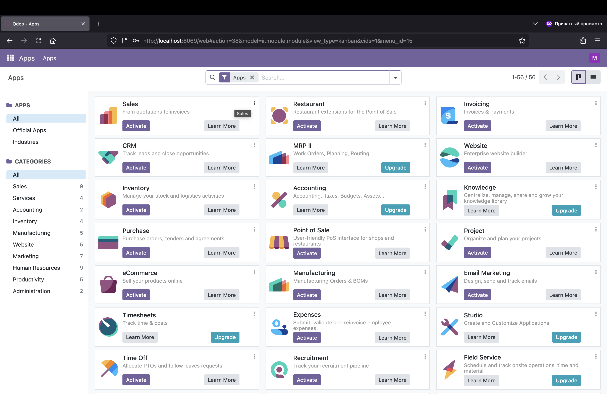
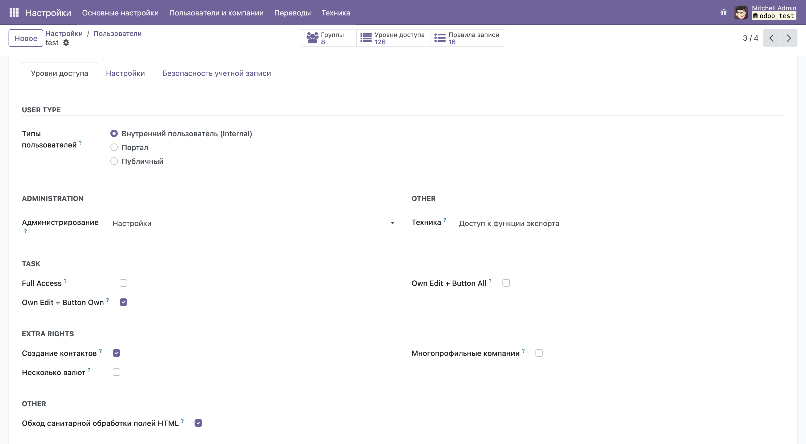
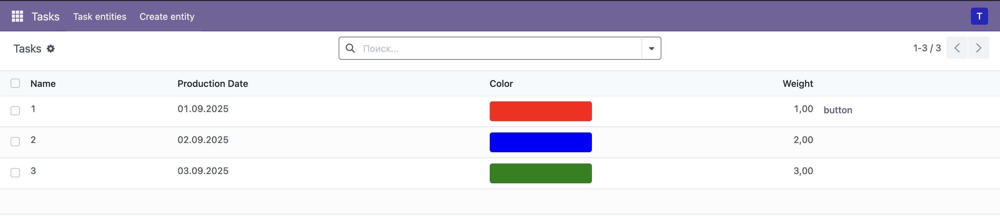
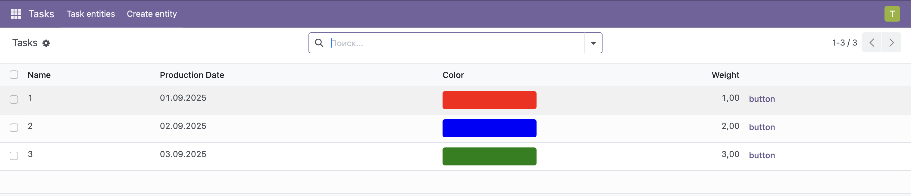
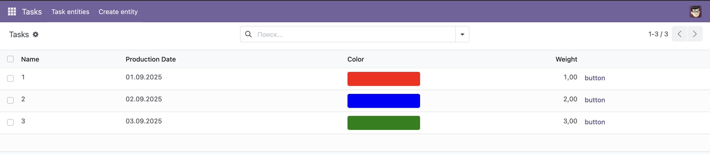
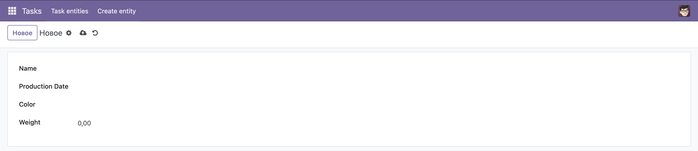

### Создал в custom-addons модуль task 

### Развернул локально в docker

### Создал 3 группы доступа

### 1 группа (кнопка и изменение только своих записей)

### 2 группа (кнопка везде, изменение только своих записей)

### 3 группа (кнопка везде, изменение всех записей)

### Форма создания

### Не получилось сделать изменение color из table view